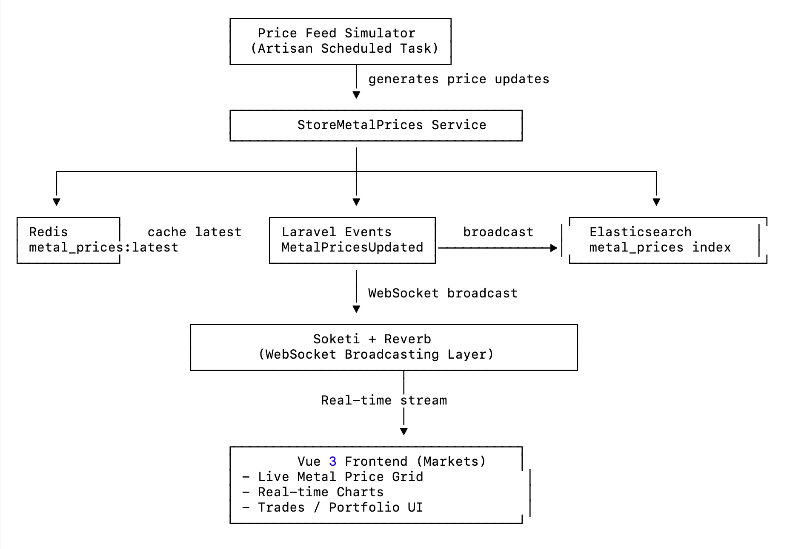
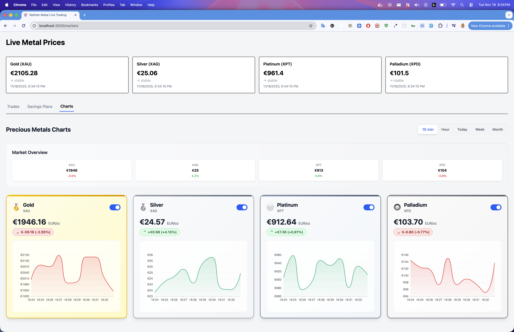

# 🏅 Metal Exchange – High-Performance Laravel + Vue Demo

---

## 🖼️ Architecture Diagram



---

## 🖼️ Screenshots

### Dashboard

---

# 🏅 Metal Exchange – High-Performance Laravel Demo

This project demonstrates a production-grade architecture inspired by high-volume 
precious metal trading platforms. It showcases realtime systems, event-driven 
processing, DDD-style boundaries, scalable data flows, and end-to-end integrations.

The backend is powered by **Laravel**, **Redis**, **Soketi**, **Reverb**, 
**MySQL**, and **Elasticsearch**.  
The frontend is built with **Vue 3**, **Vite**, and **TailwindCSS**.

---

## 🚀 Features

### 🔴 Realtime Price Engine
- Price feed simulator (updates every X seconds)
- Redis-backed price cache  
- WebSocket broadcasting via Reverb + Soketi  
- Vue dashboard auto-updates in real time  

### 🟦 Trading Engine
- Execute Buy & Sell orders
- Portfolio aggregation (real holdings)
- Atomic database transactions
- Domain actions for business logic
- Event broadcasting + queued listeners

### 🟧 Savings Plan Engine
- Create daily, weekly, or monthly plans  
- Cron-driven execution cycle  
- Each execution treated as a trade  
- All executions archived in Elasticsearch  

### 🟩 Elasticsearch Analytics
- Index metal price changes  
- Index trade executions  
- Historical chart queries  
- Time-range aggregations (minute/hour/day/week)  

### 🟨 Frontend Dashboard
- Live market prices  
- Trade execution panel  
- Portfolio panel  
- Savings Plans UI  
- Multi-chart view (historical + realtime)

---

## 🏗 Architecture Overview
```
backend/
├── app/
│   ├── Domain/
│   │   ├── Prices/
│   │   ├── Trades/
│   │   ├── Savings/
│   │   └── Search/
│   ├── Http/
│   ├── Actions/
│   ├── Listeners/
│   └── Console/
├── config/
├── routes/
├── database/
├── tests/
│   ├── Feature/
│   └── Unit/
├── docker/
│   ├── entrypoint.sh
│   ├── mysql/
│   └── nginx/
├── Dockerfile
├── composer.json
└── 
```
```
frontend/
├── src/
│   ├── components/
│   ├── composables/
│   ├── stores/
│   ├── views/
│   └── echo.ts
├── public/
├── vite.config.js
└── ...
docker/
├── docker-compose.yml
└── mysql-init.d/
    └── create_databases.sql
```
## 🔧 Requirements

- Docker + Docker Compose  
- Node 18+ (optional for local frontend dev)

---

## ▶️ Quick Start
cp .env.example .env
cp frontend/.env.example frontend/.env

docker compose up –build

Backend: http://localhost:8000  
Frontend: http://localhost:3000  
Soketi: ws://localhost:6001  
Elasticsearch: http://localhost:9200  

---

## 👤 Demo Credentials
Email: demo@example.com
Password: password123

User is seeded via database seeder.

---

## 📚 Technical Notes

### Domain-Driven Design (DDD)
The application follows a lightweight DDD-style separation:

- **Prices Domain** → price feed, caching, ES indexing  
- **Trades Domain** → buy/sell, portfolio  
- **Savings Domain** → recurring executions  
- **Search Domain** → Elasticsearch queries  

### Realtime Streaming
Uses Laravel Reverb with Soketi (Pusher protocol) broadcasting:

- MetalPricesUpdated event  
- Frontend listens on `metal-prices` channel  
- Vue updates cards + charts instantly  

### Elasticsearch
Indices:

- `metal_prices`
- `trade_executions`

Mappings are created using a console command:
php artisan elastic:sync-indices

---

## 📉 Charts

The charts page loads historical price data from Elasticsearch
and combines it with realtime ticks from WebSockets.

Time ranges implemented:

- 10m
- 1h
- Today
- Week
- Month

Each metal has:

- Spot price  
- Change %  
- Realtime sparkline  
- Full chart  

---

## 🚧 What Is Not Implemented Yet (by design)

- User registration flow (login only, seeded user)
- Advanced report exports (CSV/PDF)
- Multi-user tenancy
- Authentication guard for the Vue router
- Savings plan cancellation & editing
- Production deployment scripts

These were intentionally left out to prevent unnecessary scope-bloat and 
keep the demo focused on backend performance and architecture.

---

## 🧪 Running Tests
---
php artisan test
